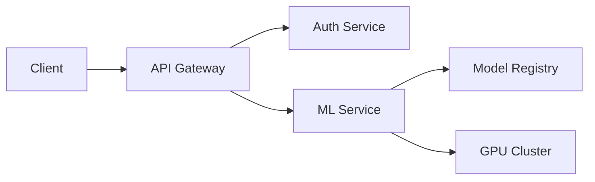
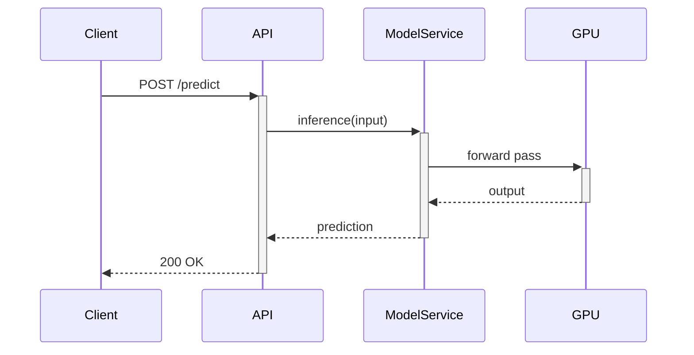
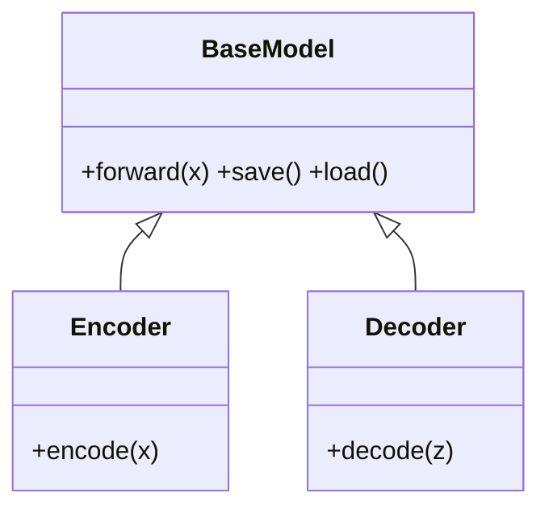

# Architecture Diagrams

## System Architecture (C4 Style)


## Sequence Diagram


## Class Diagram


## Rules
- Max ~15 nodes per diagram (split if larger)
- Clear, descriptive labels (no abbreviations without context)
- Use `graph TD` for vertical, `graph LR` for horizontal
- Always wrap in ```mermaid code blocks
